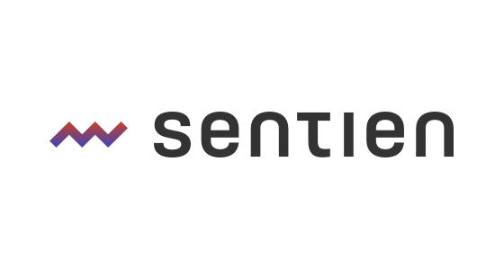

<h1>
  lowstorage | for edges & S3-compatible storages
  <br>
</h1>

> <strong>💾 Simple, lightning fast, object pseudo-database for S3-compatible storages, strongly inspired by lowdb(https://github.com/typicode/lowdb/).</strong> <br>  

[](https://github.com/good-lly/lowstorage/releases)


[](https://github.com/good-lly/lowstorage/blob/master/LICENSE)
[](https://github.com/good-lly/lowstorage)
[](https://github.com/good-lly/lowstorage/issues/)
<a href="https://github.com/good-lly/lowstorage/issues/"> </a>

[[github](https://github.com/good-lly/lowstorage)]
[[npm](https://www.npmjs.com/package/lowstorage)]

## Features

- **🚀 Lightweight** under ~129kb minified
- **🔧 Minimalist** - only [t](https://github.com/sentienhq/ultralight-s3)w[o](https://github.com/mtth/avsc) (zero-dependency) dependencies wrapped in a single package
- **💾 Familiar API** - similar to object databases like MongoDB
- **📦 BYOS3 / S3-compatibility** - "Bring-Your-Own-S3" like
  [Garage](https://garagehq.deuxfleurs.fr/), [Cloudflare R2](https://www.cloudflare.com/developer-platform/r2/), [Minio](https://github.com/minio/minio), [Ceph](https://ceph.io/), [DigitalOcean Spaces](https://www.digitalocean.com/products/spaces/), [Google Cloud Storage](https://cloud.google.com/storage/), etc.
- **🔁 Schema validation & serialization** - [Avro schema](https://avro.apache.org/docs/1.11.1/specification/) support ([fast and compact](https://github.com/mtth/avsc/wiki/Benchmarks) serialization with much smaller encodings)
- **💻 Typed** - Written in TypeScript

## Sponsors

<p align="center">
<a href="https://sentienhq.com" target="_blank"></a>

<a href="https://github.com/sponsors/good-lly" target="_blank"></a>

</p>

### Version 2 - Breaking Changes

Since version 2.0.0, `lowstorage` has undergone significant changes:

- **Support for S3 Storages / constructor changes**: The constructor now accepts any S3-compatible configuration instead of being tied to Cloudflare R2. Like AWS S3, Cloudflare R2, Minio, Ceph, DigitalOcean Spaces, Google Cloud Storage, etc. (see [S3-compatible storages](#s3-compatible-storages)) instead of using AWS-SDK it utilize S3 via the zero-dependency [`ultralight-s3`](https://github.com/good-lly/ultralight-s3) package.
- **Avro Schemas**: The constructor now accepts Avro schemas for each collection. This allows more flexibility in defining schemas and validation. If no schema is provided, it will automatically infer the schema from the data. Check out [Avro schema](https://avro.apache.org/docs/current/spec.html) documentation for more details.

If you are migrating from version 1.x.x, please review the new constructor parameters and usage examples below.

#### Cloudflare R2 vs. S3 API Compatibility

R2 uses the S3 API to allow users and their applications to migrate with ease. When comparing to AWS S3, Cloudflare has removed some API operations’ features and added others. The S3 API operations are listed below with their current implementation status. Feature implementation is currently in progress. Refer back to this page for updates. The API is available via the `https://<ACCOUNT_ID>.r2.cloudflarestorage.com` endpoint. Find your account ID in the Cloudflare dashboard.

## Table of Contents

- [Features](##features)
- [Cloudflare R2 vs. S3 API Compatibility](###cloudflare-r2-vs-s3-api-compatibility)
- [Usage & Examples](###usage--examples)
- [Installation](##installation)
- [Setup & config](###setup--config)
- [API](#api)

  - [lowstorage class](#lowstorage)

    - [constructor(options: S3Options)](#constructor)
    - [collection(colName: string, schema?: Object, autoCreate?: boolean)](#lowstorage-collection)
    - [listCollections(): Promise<string[]>](#listcollections)
    - [createCollection(colName: string, schema?: Object, data?: any[]): Promise<Collection>](#createcollection)
    - [removeCollection(colName: string): Promise<boolean>](#removecollection)
    - [collectionExists(colName: string): Promise<boolean>](#collectionexistsn)
    - [s3(): S3](#s3-s3)

  - [Collection class](#collection)

    - [constructor(colName: string, schema: any, s3: S3, dirPrefix?: string, safeWrite?: boolean, chunkSize?: number)](#collection-constructor)
    - [getProps(): CollectionProps](#getprops)
    - [setProps(props: CollectionProps): void](#setpropsprops)
    - [setSafeWrite(safeWrite: boolean): void](#setsafewrite)
    - [getSafeWrite(): boolean](#getsafewrite)
    - [getAvroSchema(): Object](#getavroschema)
    - [setAvroSchema(schema: Object): void](#setavroschemaschema)
    - [getCollectionETag(): string](#getcollectionetag)
    - [inferAvroSchema(data: Object | Array\<Object\>): Object](#inferavroschem)
    - [forceLoadData(): Promise\<boolean\>](#forceloaddata)
    - [insert(doc: Object | Array\<Object\>, schema?: Object): Promise\<Object[]\>](#insert)
    - [find(query: Object, options: Object): Promise\<Object[]\>](#find)
    - [findOne(query: Object): Promise\<Object | null\>](#findone)
    - [update(query: Object, update: Object, options: Object): Promise\<number\>](#update)
    - [updateOne(query: Record<string, any>, update: Record<string, any>, options: Record<string, any>): Promise\<number\>](#updateone)
    - [delete(query: Object): Promise\<number\>](#delete)
    - [deleteAll(): Promise\<number\>](#deleteall)
    - [count(query: Object): Promise\<number\>](#count)
    - [renameCollection(newColName: string, newSchema?: Object): Promise\<Collection\>](#renamecollection)

  - [Error classes](#error-classes)

    - [lowstorageError](#lowstorageerror)
    - [CollectionNotFoundError](#collectionnotfounderror)
    - [SchemaValidationError](#schemavalidationerror)
    - [DocumentValidationError](#documentvalidationerror)
    - [S3OperationError](#s3operationerror)

  - [Error codes](#error-codes)

- [Important Notice](##important-notice)

- [Contributing](##contributing)

- [License](##license)

### Usage & Examples

```js
import { lowstorage, lowstorage_ERROR_CODES } from 'lowstorage';
// Initialize object and get users collection
const storage = new lowstorage({
	accessKeyId: 'YOUR_ACCESS_KEY',
	secretAccessKey: 'YOUR_SECRET_KEY',
	endpoint: 'YOUR_ENDPOINT',
	bucketName: 'YOUR_BUCKET_NAME',
	region: 'YOUR_REGION', // fallback to auto
	// optional params from here
	logger?: console, // logger object for your tough times
	dirPrefix?: 'lowstorage', // folder name prefix for collections
	maxRequestSizeInBytes?: 50 * 1024 * 1024, // request size in bytes for S3 operations (default: 5MB)
});

// example user schema
const userAvroSchema = {
	type: 'record',
	name: 'User',
	fields: [
		{ name: '_id', type: 'string', size: 16, logicalType: 'UUID' },
		{ name: 'name', type: 'string' },
		{ name: 'age', type: 'int' },
		{ name: 'gender', type: 'string' },
		{ name: 'posts', type: { type: 'array', items: 'string' } },
	],
};

// Create a collection
const userCol = await storage.createCollection('users');
// or
const userCol = await storage.collection('users'); // get collection
// or
const userCol = await storage.collection('users', userAvroSchema); // get collection with specificschema

// Add new user - Avro schema is inferred from the data (_id is optional and will be autogenerated)
const newUser = await userCol.insert({
	name: 'Kevin',
	age: 32,
	gender: 'whatever',
	posts: [],
});

// Show all users
const allUsers = await userCol.find({});

// Find users with pagination (e.g., page 2, 10 users per page)
const secondPageUsers = await userCol.find({}, { skip: 10, limit: 10 });

// Find user by ID and update name
const kevin = await userCol.findOne({ name: 'Kevin' });
await userCol.update({ _id: kevin._id }, { name: 'Carlos' });

// Delete user
await userCol.delete({ name: 'Carlos' });

// Delete all users
await userCol.deleteAll();

// Count users
const count = await userCol.count();

// Rename collection
await userCol.renameCollection('usersOld');

// Remove collection
await userCol.removeCollection();

// List all collections
const listCollections = await storage.listCollections();

// Get S3 instance and perform S3 operations (get, put, delete, etc.) Read more about ultralight-s3 here: https://github.com/sentienhq/ultralight-s3
const s3ops = await storage.s3();

// check the API section for more details or /examples and /dev folder for more samples
```

### Installation

```sh
npm install lowstorage

yarn add lowstorage

pnpm add lowstorage
```

### Setup & config

To set up and bind your storage, configure your storage client with the appropriate credentials and bucket information. Here is an example setup for AWS S3:

```js
import { lowstorage, lowstorage_ERROR_CODES } from 'lowstorage';

const storage = new lowstorage({
	endPoint: 's3.amazonaws.com',
	region: 'YOUR-REGION',
	accessKey: 'YOUR-ACCESSKEYID',
	secretKey: 'YOUR-SECRETACCESSKEY',
	bucketName: 'your-bucket-name',
});
```

For Cloudflare R2, follow similar steps with your R2-specific endpoint and credentials.

## API

<a id="lowstorage"></a>

### lowstorage class

<a id="constructor"></a>

#### constructor(options: S3Options)

- **Behavior**: Creates a new lowstorage instance.

- **Input**: An object containing the following properties:
  - `accessKeyId`: The access key ID for your S3 account.
  - `secretAccessKey`: The secret access key for your S3 account.
  - `endpoint`: The endpoint URL for your S3 account.
  - `bucketName`: The name of the bucket to use.
  - `region?`: The region for your S3 bucket. Default is `auto`.
  - `logger?`: An optional logger object for your tough times.
  - `dirPrefix?`: An optional directory prefix for your collections. Default is `lowstorage`.
  - `maxRequestSizeInBytes?`: An optional maximum request size in bytes for S3 operations. Default is 5MB.
- **Returns**: A new lowstorage instance.
- **Throws**: A lowstorageError if there's an error.

#### collection(colName: string, schema?: Object, autoCreate?: boolean)

- **Behavior**: Creates or accesses a collection with the given name.
- **Input**: A string representing the name of the collection and an optional schema object.
  - `colName`: The name of the collection.
  - `schema?`: An optional schema object for the collection.
  - `autoCreate?`: An optional boolean indicating whether to automatically create the collection if it doesn't exist. Default is `true`.
- **Returns**: An instance of the Collection class corresponding to the specified collection name.
- **Throws**: A lowstorageError if there's an error.

#### listCollections(): Promise<string[]>

- **Behavior**: Lists all collections stored in the lowstorage instance.
- **Returns**: A promise that resolves to an array of collection names.
- **Throws**: A lowstorageError if there's an error.

#### createCollection(colName: string, schema?: Object, data?: any[]): Promise\<Collection\>

- **Behavior**: Creates a new collection with the given name and schema.
- **Input**: A string representing the name of the collection and an optional schema object.
  - `colName`: The name of the collection.
  - `schema?`: An optional schema object for the collection.
  - `data?`: An optional array of data to initialize the collection with - if not provided, an empty array will be used and empty file will be created.
- **Returns**: A promise that resolves to a Collection object.
- **Throws**: A lowstorageError if there's an error.

#### removeCollection(colName: string): Promise\<boolean\>

- **Behavior**: Removes a collection with the given name.
- **Input**: A string representing the name of the collection.
  - `colName`: The name of the collection.
- **Returns**: A promise that resolves to a boolean indicating whether the collection was removed.
- **Throws**: A lowstorageError if there's an error.

#### collectionExists(colName: string): Promise\<boolean\>

- **Behavior**: Checks if a collection with the given name exists.
- **Input**: A string representing the name of the collection.
  - `colName`: The name of the collection.
- **Returns**: A promise that resolves to a boolean indicating whether the collection exists.
- **Throws**: A lowstorageError if there's an error.

#### s3(): S3

- **Behavior**: Returns the S3 instance associated with the lowstorage instance. For more check the [ultralight-s3 package](https://github.com/sentienhq/ultralight-s3).
- **Returns**: The S3 instance.

## Collection class

#### constructor(colName: string, schema: any, s3: S3, dirPrefix?: string, safeWrite?: boolean, chunkSize?: number)

- **Behavior**: Creates a new Collection instance.
- **Input**: A string representing the name of the collection, an Avro schema object, an S3 instance, an optional directory prefix, an optional boolean indicating whether to perform safe writes, and an optional chunk size.
  - `colName`: The name of the collection.
  - `schema`: The Avro schema for the collection.
  - `s3`: The S3 instance.
  - `dirPrefix?`: An optional directory prefix for the collection. Default is `lowstorage`.
  - `safeWrite?`: An optional boolean indicating whether to perform safe writes. Default is `false`. Safe writes doublechecks the ETag of the object before writing. False = overwrites the object, True = only writes if the object has not been modified. (One request extra for safe writes = slower)
  - `chunkSize?`: An optional chunk size for reading and writing data. Default is 5MB.
- **Returns**: A new Collection instance.
- **Throws**: A lowstorageError if there's an error.

#### getProps(): CollectionProps

- **Behavior**: Returns the properties of the collection.
- **Returns**: An object containing the following properties:
  - `colName`: The name of the collection.
  - `s3`: The S3 instance.
  - `schema`: The Avro schema for the collection.
  - `avroParse`: The Avro parse instance.
  - `avroType`: The Avro type instance.
  - `dirPrefix`: The directory prefix for the collection.
  - `safeWrite`: A boolean indicating whether to perform safe writes.
  - `chunkSize`: The chunk size for reading and writing data.
- **Throws**: A lowstorageError if there's an error.

#### setProps(props: CollectionProps): void

- **Behavior**: Sets the properties of the collection.
- **Input**: An object containing the following properties:
  - `props`: An object containing the following properties:
    - `colName`: The name of the collection.
    - `s3`: The S3 instance.
    - `schema`: The Avro schema for the collection.
    - `avroParse`: The Avro parse instance.
    - `avroType`: The Avro type instance.
    - `dirPrefix`: The directory prefix for the collection.
    - `safeWrite`: A boolean indicating whether to perform safe writes.
    - `chunkSize`: The chunk size for reading and writing data.
- **Returns**: A void.
- **Throws**: A lowstorageError if there's an error.

#### setSafeWrite(safeWrite: boolean): void

- **Behavior**: Sets the safe write property of the collection.
- **Input**: A boolean indicating whether to perform safe writes.
  - `safeWrite`: A boolean indicating whether to perform safe writes.
- **Returns**: A void.
- **Throws**: A lowstorageError if there's an error.

#### getSafeWrite(): boolean

- **Behavior**: Returns the safe write property of the collection.
- **Returns**: A boolean indicating whether to perform safe writes.
- **Throws**: A lowstorageError if there's an error.

#### getAvroSchema(): Object

- **Behavior**: Returns the Avro schema of the collection.
- **Returns**: An object representing the Avro schema.
- **Throws**: A lowstorageError if there's an error.

#### setAvroSchema(schema: Object): void

- **Behavior**: Sets the Avro schema of the collection.
- **Input**: An object representing the Avro schema.
  - `schema`: An object representing the Avro schema.
- **Returns**: A void.
- **Throws**: A lowstorageError if there's an error.

#### getCollectionETag(): string

- **Behavior**: Returns the ETag of the collection.
- **Returns**: A string representing the ETag of the collection.
- **Throws**: A lowstorageError if there's an error.

#### inferAvroSchema(data: Object | Array\<Object\>): Object

- **Behavior**: Infers the Avro schema from the given data.
- **Input**: An object or an array of objects representing the data to infer the schema from.
  - `data`: An object or an array of objects representing the data to infer the schema from.
- **Returns**: An object representing the inferred Avro schema.
- **Throws**: A lowstorageError if there's an error.

#### forceLoadData(): Promise\<boolean\>

- **Behavior**: Forces the collection to load its data from S3.
- **Returns**: A promise that resolves to a boolean indicating whether the data was loaded successfully.
- **Throws**: A lowstorageError if there's an error.

#### insert(doc: Object | Array\<Object\>, schema?: Object): Promise\<Object[]\>

- **Behavior**: Inserts the given document(s) into the collection.
- **Input**: An object or an array of objects to insert into the collection.
  - `doc`: An object or an array of objects to insert into the collection.
  - `schema?`: An optional schema object for the collection.
- **Returns**: A promise that resolves to an array of inserted documents.
- **Throws**: A lowstorageError if there's an error.

#### find(query: Object, options: Object): Promise\<Object[]\>

- **Behavior**: Finds documents in the collection that match the given query.
- **Input**: An object representing the query to filter documents.
  - `query`: An object representing the query to filter documents.
  - `options`: An object representing the options for pagination.
- **Returns**: A promise that resolves to an array of matching documents.
- **Throws**: A lowstorageError if there's an error.

#### findOne(query: Object): Promise\<Object | null\>

- **Behavior**: Finds the first document in the collection that matches the given query.
- **Input**: An object representing the query to filter documents.
  - `query`: An object representing the query to filter documents.
- **Returns**: A promise that resolves to the first matching document or null if no match is found.
- **Throws**: A lowstorageError if there's an error.

#### update(query: Object, update: Object, options: Object): Promise\<number\>

- **Behavior**: Updates documents in the collection that match the given query.
- **Input**: An object representing the query to filter documents and an object representing the update operations.
  - `query`: An object representing the query to filter documents.
  - `update`: An object representing the update operations.
  - `options`: An object representing the options for pagination.
- **Returns**: A promise that resolves to the number of documents updated.
- **Throws**: A lowstorageError if there's an error.

#### updateOne(query: Record\<string, any>, update: Record\<string, any>, options: Record\<string, any>): Promise\<number\>

- **Behavior**: Updates the first document in the collection that matches the given query.
- **Input**: An object representing the query to filter the document to update and an object representing the update operations.
  - `query`: An object representing the query to filter the document to update.
  - `update`: An object representing the update operations.
  - `options`: An object representing the options for pagination.
- **Returns**: A promise that resolves to the number of documents updated.
- **Throws**: A lowstorageError if there's an error.

#### delete(query: Object): Promise\<number\>

- **Behavior**: Deletes documents in the collection that match the given query.
- **Input**: An object representing the query to filter documents.
  - `query`: An object representing the query to filter documents.
- **Returns**: A promise that resolves to the number of documents deleted.
- **Throws**: A lowstorageError if there's an error.

#### deleteAll(): Promise\<number\>

- **Behavior**: Deletes all documents in the collection.
- **Returns**: A promise that resolves to the number of documents deleted.
- **Throws**: A lowstorageError if there's an error.

#### count(query: Object): Promise\<number\>

- **Behavior**: Counts the number of documents in the collection that match the given query.
- **Input**: An object representing the query to filter documents.
  - `query`: An object representing the query to filter documents.
- **Returns**: A promise that resolves to the number of documents in the collection.
- **Throws**: A lowstorageError if there's an error.

#### renameCollection(newColName: string, newSchema?: Object): Promise\<Collection\>

- **Behavior**: Renames the collection with the given name and schema.
- **Input**: A string representing the new name of the collection and an optional new schema object.
  - `newColName`: The new name of the collection.
  - `newSchema?`: An optional new schema object for the collection.
- **Returns**: A promise that resolves to a Collection object.
- **Throws**: A lowstorageError if there's an error.

## Error classes

#### lowstorageError

- **Behavior**: Represents a lowstorage error.
- **Input**: An optional string representing the error message and an optional error code.
  - `message?`: An optional string representing the error message.
  - `code?`: An optional error code.
- **Returns**: A new lowstorageError instance.
- **Throws**: A lowstorageError if there's an error.

#### CollectionNotFoundError

- **Behavior**: Represents a CollectionNotFound error.
- **Input**: An optional string representing the error message and an optional error code.
  - `message?`: An optional string representing the error message.
  - `code?`: An optional error code.
- **Returns**: A new CollectionNotFoundError instance.
- **Throws**: A lowstorageError if there's an error.

#### SchemaValidationError

- **Behavior**: Represents a SchemaValidation error.
- **Input**: An optional string representing the error message and an optional error code.
  - `message?`: An optional string representing the error message.
  - `code?`: An optional error code.
- **Returns**: A new SchemaValidationError instance.
- **Throws**: A lowstorageError if there's an error.

#### DocumentValidationError

- **Behavior**: Represents a DocumentValidation error.
- **Input**: An optional string representing the error message and an optional error code.
  - `message?`: An optional string representing the error message.
  - `code?`: An optional error code.
- **Returns**: A new DocumentValidationError instance.
- **Throws**: A lowstorageError if there's an error.

#### S3OperationError

- **Behavior**: Represents an S3Operation error.
- **Input**: An optional string representing the error message and an optional error code.
  - `message?`: An optional string representing the error message.
  - `code?`: An optional error code.
- **Returns**: A new S3OperationError instance.
- **Throws**: A lowstorageError if there's an error.

## Error codes

#### lowstorage_ERROR_CODES

- **Behavior**: Represents a lowstorage error code constants. Check the [error classes](#error-classes) and [`src/errors.ts`](https://github.com/good-lly/lowstorage/blob/master/src/errors.ts) for more details.
- **Returns**: An object containing the following properties:
  - `MISSING_ARGUMENT`: A string representing the missing argument error code.
  - `COLLECTION_EXISTS`: A string representing the collection exists error code.
  - `CREATE_COLLECTION_ERROR`: A string representing the create collection error code.
  - `RENAME_COLLECTION_ERROR`: A string representing the rename collection error code.
  - `REMOVE_COLLECTION_ERROR`: A string representing the remove collection error code.
  - `UPDATE_COLLECTION_SCHEMA_ERROR`: A string representing the update collection schema error code.
  - `COLLECTION_NOT_FOUND`: A string representing the collection not found error code.
  - `SCHEMA_VALIDATION_ERROR`: A string representing the schema validation error code.
  - `DOCUMENT_VALIDATION_ERROR`: A string representing the document validation error code.
  - `S3_OPERATION_ERROR`: A string representing the S3 operation error code.
  - `FIND_ERROR`: A string representing the find error code.
  - `FIND_ONE_ERROR`: A string representing the find one error code.
  - `SAVE_DATA_ERROR`: A string representing the save data error code.
  - `INSERT_ERROR`: A string representing the insert error code.
  - `UPDATE_ERROR`: A string representing the update error code.
  - `UPDATE_ONE_ERROR`: A string representing the update one error code.
  - `DELETE_ERROR`: A string representing the delete error code.
  - `COUNT_ERROR`: A string representing the count error code.
  - `UNKNOWN_ERROR`: A string representing the unknown error code.

## Important Notice

`lowstorage` is primarily designed for small, hobby, or personal projects. We advise extreme caution when using `lowstorage` for critical applications or production environments, as it may not offer the robustness or features required for such use cases.

## Contributing

Feel free to dive in! [Open an issue](https://github.com/good-lly/lowstorage/issues/new) or submit PRs.

Standard Readme follows the [Contributor Covenant](http://contributor-covenant.org/version/1/3/0/) [Code of Conduct](https://github.com/good-lly/lowstorage/blob/master/CODE_OF_CONDUCT.md).

## License

[MIT](LICENSE)
